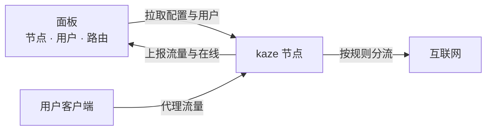

---
hide:
  - navigation
  - toc
---

<section class="kz-hero" markdown>

面向机场的代理节点后端 · 对接 Xboard / V2board / PPanel

# 更少的内存，更少的 CPU， 更多的用户。

kaze 的协议全部自研，为「一台机器承载尽可能多的用户」而设计。一个进程跑全部协议，设置全在面板里改，授权码对接即生效，续费、换绑不用换码不用重启。

[快速开始](quickstart/prepare.md){ .md-button .md-button--primary }
[查看性能对比](performance.md){ .md-button }

<b>1/9</b>Shadowsocks 2022 空闲内存 相对 Xray / sing-box

<b>19–71%</b>每 GB 转发少用的 CPU 相对 Xray，三种协议

<b>10</b>种协议 一个进程混跑

<b>100</b>免费版每节点用户数 功能不阉割，授权版按协议解锁人数

同一台 Linux 机器上与 Xray、sing-box 在相同负载下实测，<a href="performance/">测试条件与完整数据</a>。

</section>

-   :material-lightning-bolt:{ .lg .middle } **自研内核**

    ---

    协议全部自己实现，不基于 Xray 或 sing-box。专为「多用户、低资源」设计，单机承载更多用户：空闲连接内存最低可到 Xray / sing-box 的 1/9，转发 CPU 三种协议均为最低。

    [:octicons-arrow-right-24: 性能对比](performance.md)

-   :material-shield-lock:{ .lg .middle } **十种协议 · 七种传输**

    ---

    Trojan、Shadowsocks、VLESS、VMess、Hysteria2、TUIC、AnyTLS、Mieru、SOCKS5、HTTP，支持 REALITY、Vision、Shadow TLS。

    [:octicons-arrow-right-24: 协议与传输](panel/protocols.md)

-   :material-account-cog:{ .lg .middle } **节点只填三项**

    ---

    端口、加密、传输、证书、用户、路由全部在面板设置，节点自动同步。只需填节点 ID、面板地址、通讯密钥。

    [:octicons-arrow-right-24: 面板设置对照](panel/compat.md)

-   :material-speedometer:{ .lg .middle } **精细的用户限制**

    ---

    限速、设备数、连接数、动态限速、节点总带宽、防爆破，面板套餐里的限速与本机值取较小者；设备数以面板为准，本机值只给面板没设的用户兜底。

    [:octicons-arrow-right-24: 用户限制与风控](features/limits.md)

-   :material-sign-direction:{ .lg .middle } **分流与出口**

    ---

    面板路由 + 本机路由文件，出口组负载均衡。出口支持 SOCKS5、HTTP、WireGuard(WARP)、Trojan、VLESS、Shadowsocks。

    [:octicons-arrow-right-24: 分流与出口](features/routing.md)

-   :material-key-chain:{ .lg .middle } **授权码**

    ---

    一个授权码管整个面板，节点数不限，首次对接自动绑定。续费、升级在节点上无需任何操作，换绑后只需在新面板的节点填同一个码；授权服务器短时不可达不影响运行。

    [:octicons-arrow-right-24: 授权说明](license.md)

## 能力一览

| 类别 | 支持 |
| --- | --- |
| **协议** | Trojan · Shadowsocks · VLESS · VMess · Hysteria2 · TUIC · AnyTLS · Mieru · SOCKS5 · HTTP，除 HTTP 代理外均支持 UDP |
| **传输** | TCP · WebSocket · HTTPUpgrade · gRPC · H2 · XHTTP · QUIC · 多路复用 · REALITY · **Shadow TLS v3 内置**（面板选插件即可，单端口，不用另跑 shadow-tls 进程） |
| **安全层** | TLS · REALITY · Vision 流控 · Shadow TLS · Salamander · simple-obfs |
| **用户限制** | 限速 · 设备数 · 连接数 · 动态限速 · 节点总带宽 · 防爆破 |
| **审计** | 协议嗅探 · 屏蔽 BT · 屏蔽内网 · 端口黑名单 · 审计规则 · 白名单 · geosite / geoip |
| **分流出口** | 面板路由 · 本机路由文件 · 出口组负载均衡 · 六种出口类型 |
| **DNS** | UDP · TCP · DoT · DoH · 多服务器回退 · 按域名分流 |
| **证书** | 自动申请续期 · 面板下发 · 证书文件 · 自签 |
| **部署** | 一键脚本 · Docker · 单进程混跑多节点多协议 · 一台机器多个面板 · 每节点独立设置 · 源进源出 · 不接面板也能直接搭节点 |

## 工作方式

!!! tip "三样东西就能跑起来"
    面板里建好节点后，节点这边只需要 **节点 ID**、**面板地址**、**通讯密钥**。其余设置由面板下发。开启 [Xboard 的 WebSocket 推送](panel/xboard.md#实时推送websocket)后，面板改动数秒内生效；否则按拉取周期同步。

## 免费版与授权版

| | 免费版 | 授权版 |
| --- | :---: | :---: |
| 每节点有效用户数 | 100 | 按授权 |
| 协议 | 全部 | 按授权所含的协议 |
| 功能 | 全部 | 全部 |
| 节点收到的有效用户数 | ≤ 300 | 不限 |

不填授权就是免费版，协议和功能都不阉割。详见 [授权说明](license.md)。

### 购买授权 { #购买授权 }

授权在 Telegram 销售机器人里购买、续费、升级、换绑，USDT（TRC20）付款即时发放：[**@kaze_auth_bot**](https://t.me/kaze_auth_bot)。机器人里发 `/price` 看价目表；购买规则见[授权说明 → 购买须知](license.md#购买须知)。

版本更新、公告和使用交流在频道 [**@kaze_core**](https://t.me/kaze_core)。
