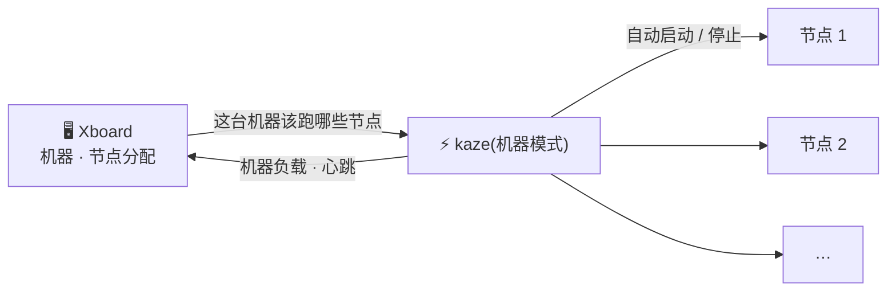

# Xboard 机器模式（自动部署）

Xboard 可以先添加「机器」（服务器），再把节点分配给机器。kaze 支持这种模式：**机器上只装一次 kaze，之后在面板里给这台机器加节点、删节点，kaze 自动启动或停止对应节点**，不用改配置、不用重启。



## 安装

<span class="kz-step">1</span> 在 Xboard 后台「服务器管理 → 机器」添加一台机器，面板会显示一条安装命令，类似：

```bash
curl -fsSL https://raw.githubusercontent.com/cedar2025/xboard-node/dev/install.sh | sudo bash -s -- --mode machine --panel 'https://你的面板' --token '机器令牌' --machine-id 1
```

<span class="kz-step">2</span> **把命令里的安装脚本地址换成 kaze 的，末尾加上授权码**，其余参数原样保留：

!!! warning "`--panel` 要填面板的 API 地址"
    面板生成的命令里 `--panel` 是站点地址。如果你的用户前端是分离部署的（主题包单独放在别的域名，`config.js` 里有 `server_url`），节点要连的是 `server_url` 那个后台域名，不是前端站。填错时日志会提示「the address answered a web page, not the panel API」，用 `kaze config webapi_url=https://后台域名 && kaze restart` 改过来。

```bash
curl -fsSL https://github.com/kazeproxy/kaze-release/raw/main/install.sh | sudo bash -s -- --mode machine --panel 'https://你的面板' --token '机器令牌' --machine-id 1 --license KZ-XXXX-XXXX-XXXX
```

`--license` 填在机器人买到的授权码，这台机器上所有节点共用，首次对接自动绑定面板。不加的话按免费版运行（每节点 100 人），之后可以用 `kaze config license_key=KZ-XXXX-XXXX-XXXX && kaze restart` 补上。

<span class="kz-step">3</span> 回到面板，在添加或编辑节点时选择这台机器，节点就会在一个拉取周期内自动启动（周期由面板「系统配置 → 节点配置 → 节点拉取动作轮询间隔」决定，默认 60 秒；节点可用 `check_interval=` 覆盖）。

!!! tip "已经装过 kaze 的机器"
    在配置文件里加三行即可，不再需要 `node_id`:
    ```ini
    machine_id=1
    machine_token=机器令牌
    license_key=KZ-XXXX-XXXX-XXXX
    ```
    然后 `kaze restart`。

## 面板上会显示什么

| 面板位置 | 显示 |
| --- | --- |
| 机器列表「在线」 | :material-check: 心跳 300 秒内即在线，kaze 每个拉取周期都会刷新（所以面板的拉取间隔不要大于 300 秒） |
| 机器负载图表 | :material-check: CPU、内存、交换区、磁盘、网速（Linux） |
| 节点在线、在线人数、负载 | :material-check: 与普通模式相同 |
| 流量统计与扣费 | :material-check: 与普通模式相同；节点被移走时会先补报流量再停止 |

## 说明

- 节点的协议、端口、证书等全部来自面板。在配置文件里写 `[node 节点ID]` 段落，仍可给某个节点单独设置，写法见[一台机器多节点、多协议](../features/multinode.md)。
- 面板改动在下一个拉取周期内生效，默认最长 60 秒。Xboard 的 WebSocket 实时推送暂未接入。
- 同一台机器上的两个节点不能用同一个端口。面板不会检查这一点，冲突的那个节点会在日志里报错，换端口后自动重试。
- 一个节点不要同时用普通模式和机器模式对接。
- 一台机器要同时给两个面板跑节点，见[一台机器多个面板](multi-panel.md)。
